<p align="center">
  
</p>

<p align="center">
  
</p>

<p align="center">
  <strong>AI-powered no-code platform — describe what you want, watch it build, run it live in your browser.</strong>
</p>

<p align="center">
  Chat-to-build · In-browser sandbox · Multi-model AI · Plan &amp; Build modes · Version history · Team collaboration
</p>

<p align="center">
  <a href="#quick-start">Quick Start</a> ·
  <a href="#architecture">Architecture</a> ·
  <a href="#features">Features</a> ·
  <a href="#api-reference">API</a> ·
  <a href="#environment-variables">Environment</a> ·
  <a href="#integrations">Integrations</a>
</p>

---

> **Note:** NextGen is actively evolving. Some surfaces are marked early access. If something breaks, check [Troubleshooting](#troubleshooting) — or blame the cat above. 🐱

---

## Table of Contents

1. [What is NextGen?](#what-is-nextgen)
2. [Quick Start](#quick-start)
3. [Repository Layout](#repository-layout)
4. [Architecture](#architecture)
5. [Features](#features)
6. [End-to-End Flows](#end-to-end-flows)
7. [Frontend Deep Dive](#frontend-deep-dive)
8. [Backend Deep Dive](#backend-deep-dive)
9. [Data Model](#data-model)
10. [Storage & Caching](#storage--caching)
11. [API Reference](#api-reference)
12. [Environment Variables](#environment-variables)
13. [Integrations](#integrations)
14. [Build, Test & Production](#build-test--production)
15. [Security & Reliability](#security--reliability)
16. [Troubleshooting](#troubleshooting)
17. [Roadmap](#roadmap)

---

## What is NextGen?

NextGen is an **end-to-end AI application builder**. Users describe apps in natural language; the platform:

1. **Plans** architecture (optional Plan mode)
2. **Generates** React + TypeScript + Tailwind code via streaming LLMs
3. **Writes files** into an in-browser WebContainer sandbox
4. **Runs** `npm install` and the dev server automatically
5. **Previews** the live app without any local setup
6. **Persists** every generation as versioned history in Neon Postgres
7. **Integrates** with Figma, Google Stitch, Supabase, and GitHub

The product is split into two packages:

| Package | Role |
|---------|------|
| `frontend/` | React + Vite SPA — landing page, chat UI, workbench, WebContainer runtime |
| `backend/` | Express + TypeScript API — auth, LLM orchestration, persistence, integrations |

There is **no root `package.json`**. Run commands from `frontend/` or `backend/` separately.

### Tech Stack at a Glance

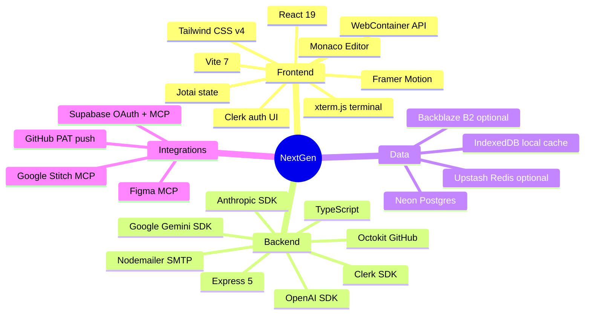

---

## Quick Start

### Prerequisites

- **Node.js** 20+ (LTS recommended)
- **npm** 10+
- A [Clerk](https://clerk.com) application (publishable + secret keys)
- A [Neon](https://neon.tech) Postgres database
- At least **one** AI provider API key (OpenAI, Anthropic, or Google Gemini)

### 1. Clone & configure

```bash
git clone https://github.com/SpiritOfKedar/nextgen
cd nextgen
```

**Backend** — copy and fill in `backend/.env`:

```bash
cp backend/.env.example backend/.env
# Edit backend/.env — see Environment Variables section
```

**Frontend** — copy and fill in `frontend/.env`:

```bash
cp frontend/.env.example frontend/.env
# Edit frontend/.env
```

> **Portgres required:** `CLERK_SECRET_KEY`, `DATABASE_URL`, and at least one of `OPENAI_API_KEY`, `ANTHROPIC_API_KEY`, or `GEMINI_API_KEY`.

### 2. Start the backend

```bash
cd backend
npm install
npm run dev
```

Default API: `http://localhost:3003`  
Health check: `GET http://localhost:3003/health`  
Readiness: `GET http://localhost:3003/ready`

### 3. Start the frontend

```bash
cd frontend
npm install
npm run dev
```

Open: `http://localhost:5173`

### 4. Sign in & build

1. Click **Get started** on the landing page (Clerk auth modal)
2. Describe an app in the prompt box (e.g. *"Build a todo app with dark mode"*)
3. Watch files stream in, dependencies install, and the preview go live
4. Navigate to `/builder` for the full workbench experience

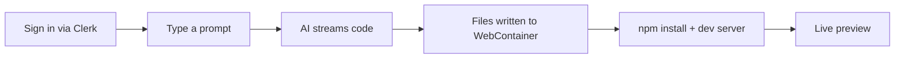

---

## Repository Layout

```text
nextgen/
├── README.md                          # This file — single source of truth
├── docs/
│   └── assets/
│       └── under-catstruction.png     # README mascot 
│
├── frontend/                          # React + Vite client
│   ├── src/
│   │   ├── App.tsx                    # Routes: /, /builder, /features/:slug, /preview/:id
│   │   ├── main.tsx                   # ClerkProvider + BrowserRouter bootstrap
│   │   ├── config/
│   │   │   └── clerkAppearance.ts     # Branded Clerk sign-in / UserButton theme
│   │   ├── components/
│   │   │   ├── LandingPage.tsx        # Marketing landing + mac-style prompt
│   │   │   ├── Navbar.tsx             # Nav, auth buttons, UserButton
│   │   │   ├── Hero.tsx               # Landing hero copy
│   │   │   ├── Footer.tsx
│   │   │   ├── PlatformNavModal.tsx   # Platform feature picker
│   │   │   ├── Chat/                  # Chat panel, input, messages, integrations
│   │   │   │   ├── ChatPanel.tsx
│   │   │   │   ├── InputArea.tsx      # Prompt input, mode/model, attachments
│   │   │   │   ├── MessageList.tsx
│   │   │   │   ├── ModelSelector.tsx
│   │   │   │   ├── FigmaPanel.tsx
│   │   │   │   ├── StitchPanel.tsx
│   │   │   │   ├── SupabasePanel.tsx
│   │   │   │   ├── ShareThreadModal.tsx
│   │   │   │   └── ...
│   │   │   ├── Workbench/             # Editor, preview, terminal, file tree
│   │   │   │   ├── Workbench.tsx
│   │   │   │   ├── EditorPanel.tsx    # Monaco editor
│   │   │   │   ├── PreviewPanel.tsx   # iframe preview
│   │   │   │   ├── TerminalPanel.tsx  # xterm.js shell
│   │   │   │   ├── FileTree.tsx
│   │   │   │   ├── VersionHistoryModal.tsx
│   │   │   │   └── PushToGitHubModal.tsx
│   │   │   ├── Landing/               # Feature pages, ticker, agent section
│   │   │   └── Layout/                # MainLayout, BackgroundGrid, CursorGlow
│   │   ├── hooks/
│   │   │   └── useChat.ts             # Core orchestration: stream, sandbox, recovery
│   │   ├── store/                     # Jotai atoms (chat, files, sandbox, MCP)
│   │   ├── lib/                       # Bolt protocol, WebContainer, snapshots
│   │   ├── pages/
│   │   │   ├── HostedPreview.tsx      # Public shareable preview route
│   │   │   └── FeaturePageRoute.tsx
│   │   └── data/
│   │       └── features.ts            # Landing feature definitions
│   ├── .env.example
│   └── package.json
│
└── backend/                           # Express + TypeScript API
    ├── src/
    │   ├── server.ts                  # Boot, port, orphan stream cleanup
    │   ├── app.ts                     # Express app, CORS, health/ready, error handler
    │   ├── routes/index.ts            # All /api routes
    │   ├── controllers/               # chat, sandbox, terminal, figma, stitch, github, supabase, preview, collaborators
    │   ├── services/                  # chatService, MCP clients, email, B2, GitHub push
    │   ├── repositories/              # Postgres data access
    │   ├── middlewares/               # Clerk auth, request context
    │   ├── config/                    # db, models, b2, runtimeSchema
    │   ├── prompts/systemPrompt.ts    # LLM system prompt + bolt protocol spec
    │   └── lib/                       # logger, redis, plan context
    ├── tests/                         # Node test runner unit tests
    ├── assets/nextgen-logo.png        # Used in invite emails
    ├── .env.example
    └── package.json
```

---

## Architecture

### High-Level System Diagram

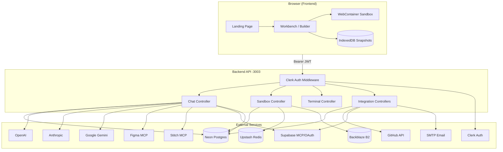

### Request Lifecycle (Authenticated Chat)

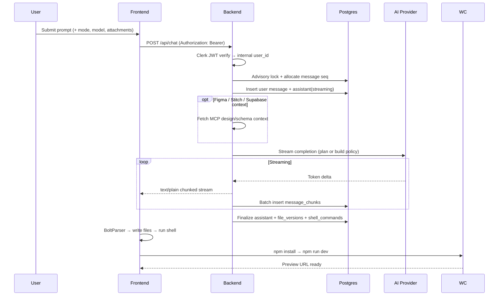

### Frontend Routes

| Route | Component | Auth | Description |
|-------|-----------|------|-------------|
| `/` | `LandingPage` | Optional | Marketing page + mac-style prompt input |
| `/builder` | `MainLayout` | Required | Full workbench: chat + editor + preview + terminal |
| `/features/:slug` | `FeaturePageRoute` | Public | Individual feature marketing pages |
| `/preview/:threadId` | `HostedPreview` | Public | Standalone hosted preview (no auth) |

---

## Features

### Product Features

#### 1. Chat-to-Build

Describe apps in plain language. The AI generates a full React project — files stream in real time, shell commands execute automatically, and the dev server starts without manual setup.

- Natural language input with optional **prompt enhancement** (`POST /api/chat/enhance-prompt`)
- **Voice input** via audio transcription (`POST /api/chat/transcribe`)
- Streaming markdown rendering with syntax-highlighted code blocks
- Structured **Bolt protocol** output (`<boltArtifact>` / `<boltAction>` XML tags)

#### 2. Plan & Build Modes

Two conversation modes with distinct AI behavior:

| Mode | Purpose | File writes | Shell commands |
|------|---------|-------------|----------------|
| **Plan** | Architecture, pages, data flow | ❌ Blocked | ❌ Blocked |
| **Build** | Generate and run code | ✅ Allowed | ✅ Allowed |

Approved plan context is stored in `thread_plan_contexts` and injected into subsequent build prompts.

**Split build phases** (advanced): the frontend can run a two-phase build — `backend` first, then `ui` — for large projects.

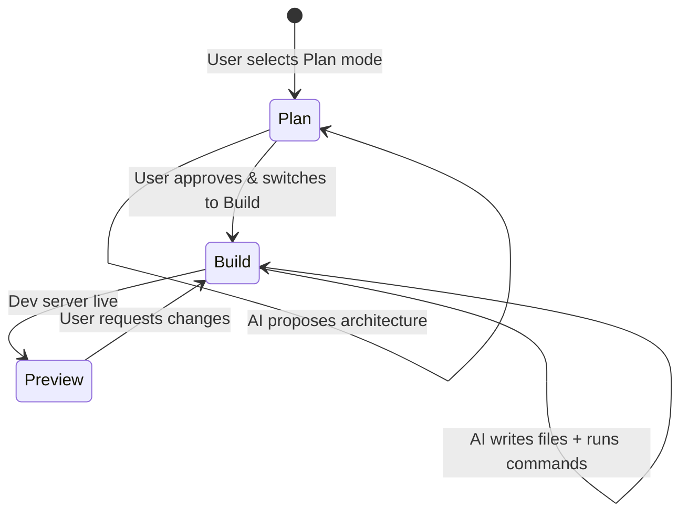

#### 3. Live Preview (WebContainer)

Every generated app runs in an **in-browser Node.js sandbox** powered by [WebContainer API](https://webcontainer.io):

- Real `npm install` and `npm run dev`
- iframe preview panel with live reload
- No local Node.js installation required
- Dependency fingerprinting + snapshot reuse for fast re-opens

#### 4. Version History

Every AI generation creates an immutable version:

- Per-message file versions stored in Postgres (`file_versions`)
- Browse history in `VersionHistoryModal`
- Restore individual files or entire project (`POST /api/chat/:threadId/restore`)
- List all versions: `GET /api/chat/:threadId/versions`

#### 5. Hosted Preview (Shareable Links)

Public preview URLs without authentication:

- Route: `/preview/:threadId`
- API: `GET /api/preview/:threadId` (public, no auth)
- Boots WebContainer, installs deps, and renders the app standalone
- Useful for sharing demos with stakeholders

---

### Platform Features

#### 6. Multi-Model AI

Switch between providers without losing thread context:

| Provider | Example Models |
|----------|----------------|
| OpenAI | GPT-4o Mini, GPT-5.2, Codex 5.3 (Responses API) |
| Anthropic | Claude Opus 4.5/4.6, Sonnet 4.5, Haiku 4.5 |
| Google | Gemini 2.5 Flash, Gemini 3 Pro |

- **Auto mode** picks a model based on task
- **Recovery model** defaults to Claude Haiku for terminal auto-fix
- Mode-aware system prompts enforce plan vs build policy

#### 7. Workbench

The `/builder` layout is a full IDE-like experience:

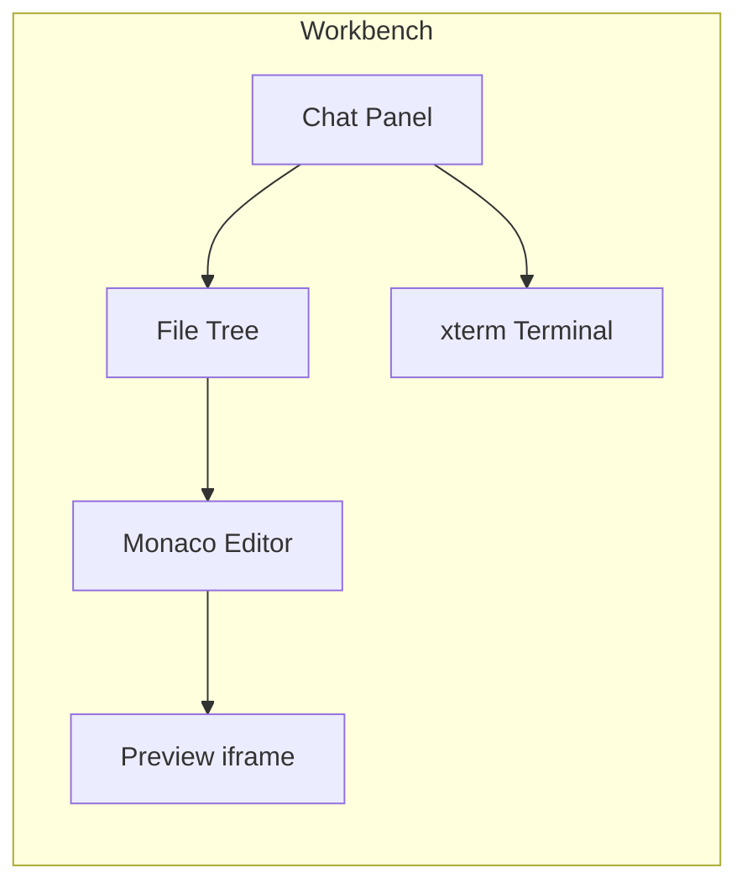

- Resizable panels (`react-resizable-panels`)
- File tree with create/rename/delete
- Monaco editor with syntax highlighting
- Terminal with persisted session history
- Download project as ZIP
- Push to GitHub modal

#### 8. Terminal Auto-Recovery

When the dev server or build fails, NextGen can automatically diagnose and fix issues:

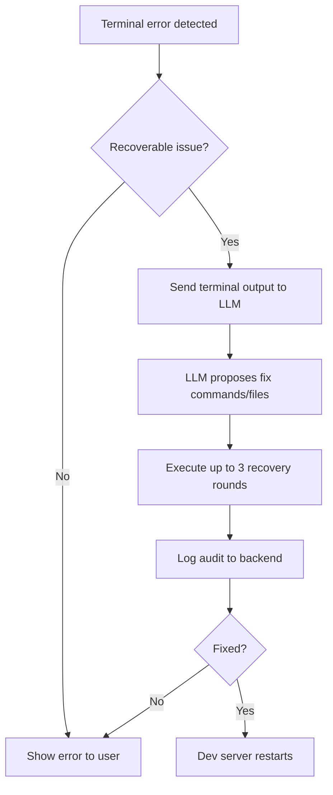

- Events: `POST /api/terminal/:threadId/events`
- Recovery audits: `POST /api/terminal/:threadId/recovery-audits`
- Server-side recovery: `POST /api/terminal/:threadId/recover`
- Session replay: `GET /api/terminal/:threadId/session`

#### 9. Sandbox Dependency Snapshots

Avoid repeated `npm install` on every thread reload:

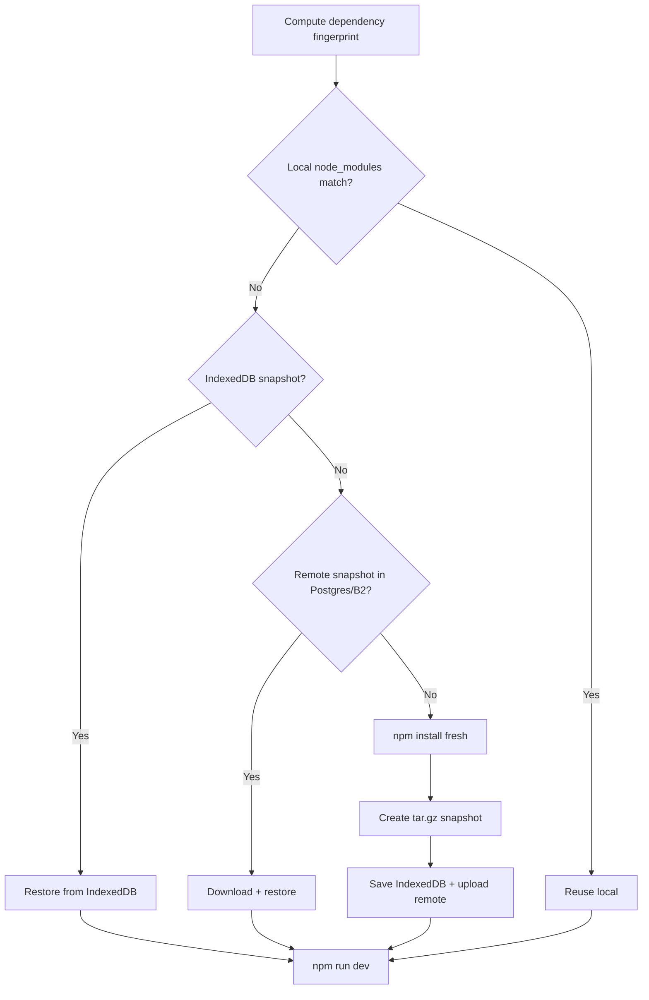

#### 10. Collaboration

Invite teammates to work on the same project thread:

- Share modal in chat panel (`ShareThreadModal`)
- Invite by email (user must already be registered on NextGen)
- Roles: `editor` (extensible)
- SMTP invite emails with branded HTML template
- API: `GET/POST/DELETE /api/chat/:id/collaborators`

#### 11. Landing Page & Feature Pages

Marketing site built into the frontend:

- Dark neon aesthetic with animated grid background
- Hero + mac-style prompt window on landing
- Feature strip, status ticker, agent section
- Individual pages at `/features/:slug` for each capability
- Branded Clerk auth (custom dark theme in `clerkAppearance.ts`)

---

## End-to-End Flows

### Flow 1: First Prompt → Running App

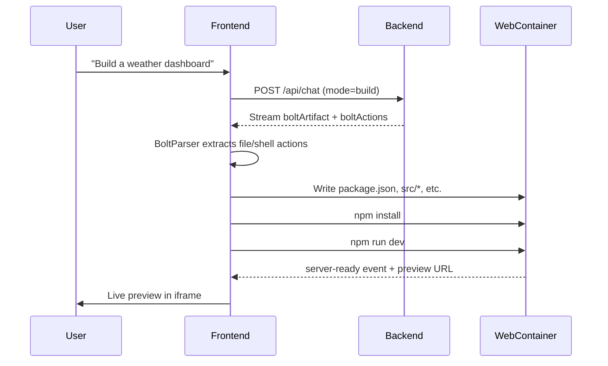

### Flow 2: Thread Reload

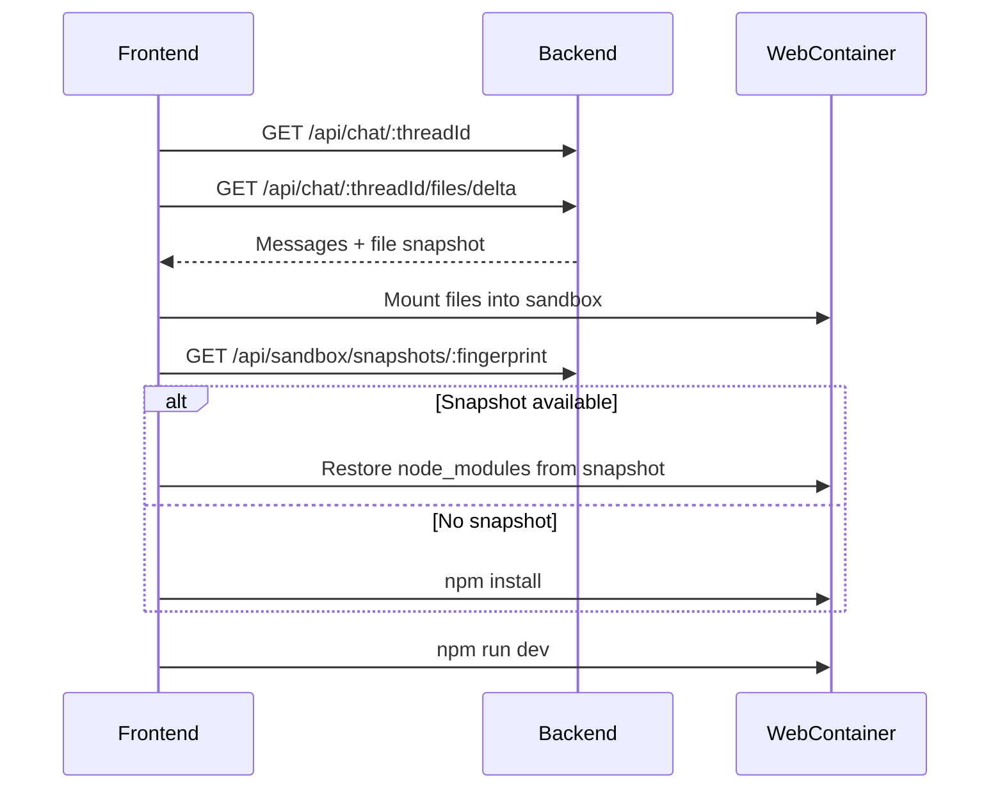

### Flow 3: Collaborator Invite

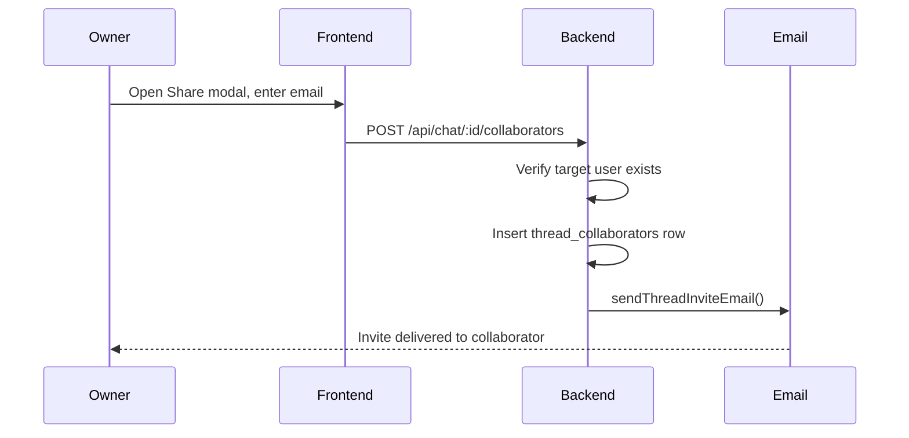

### Flow 4: Push to GitHub

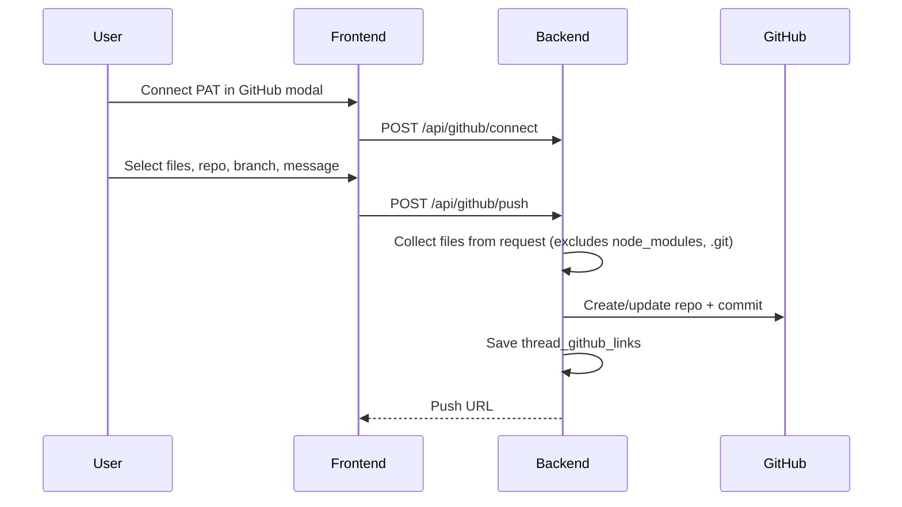

---

## Frontend Deep Dive

### State Management (Jotai)

| Atom file | Responsibility |
|-----------|----------------|
| `store/atoms.ts` | Messages, thread ID, chat mode, model selection |
| `store/fileSystem.ts` | Virtual file tree, editor tabs |
| `store/webContainer.ts` | Sandbox boot status, preview URL |
| `store/mcpAttachments.ts` | Figma/Stitch/Supabase attachment state |

### Bolt Protocol

The AI emits structured XML that the frontend parses incrementally:

```xml
<boltArtifact id="project-build" title="Todo App">
  <boltAction type="file" filePath="src/App.tsx">
    // file contents here
  </boltAction>
  <boltAction type="shell">
    npm install
  </boltAction>
  <boltAction type="patch" filePath="src/App.tsx">
    <<<<<<< SEARCH
    old code
    =======
    new code
    >>>>>>> REPLACE
  </boltAction>
  <boltAction type="supabase-migration" id="001_create_todos">
    CREATE TABLE todos (...);
  </boltAction>
</boltArtifact>
```

**Action types:**

| Type | Behavior |
|------|----------|
| `file` | Write or overwrite a file |
| `shell` | Execute command in WebContainer terminal |
| `patch` | Search/replace edit on existing file |
| `supabase-migration` | Collect SQL migration for Supabase apply |

Parser: `frontend/src/lib/boltProtocol.ts` (`BoltParser` class)

### Key Hooks

**`useChat.ts`** — the central orchestrator (~2000+ lines):

- Sends messages, handles streaming responses
- Parses bolt actions and updates file system
- Manages WebContainer lifecycle (boot, install, dev server)
- Thread switching, history loading, delta file sync
- Terminal auto-recovery scheduling
- Collaborator CRUD, prompt enhancement, audio transcription
- Split build phases (`backend` → `ui`)

---

## Backend Deep Dive

### Chat Service Pipeline

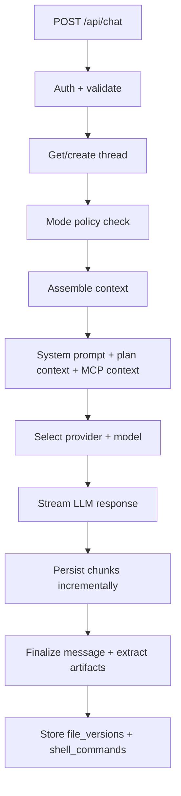

### Mode Policy

Enforced in `chatService.ts`:

- **Plan mode:** rejects file/shell artifact persistence; stores plan text in `thread_plan_contexts`
- **Build mode:** persists all artifacts; injects approved plan context into prompt
- **Build phase:** `full` | `backend` | `ui` — scopes what the AI should generate

### Boot Sequence

```mermaid
flowchart TD
    A[server.ts starts] --> B[Listen on PORT]
    B --> C[connectDB async]
    C --> D[ensureRuntimeSchema]
    D --> E[abortOrphanStreaming]
    E --> F[isAppReady = true]
    F --> G[/ready returns 200]
```

- **`/health`** — liveness, always returns 200
- **`/ready`** — readiness, requires DB + schema migration complete
- **`/api/*`** — returns 503 until ready

### Logging

Structured logging via `lib/logger.ts`:

- Levels: `debug | info | warn | error`
- Formats: `text` (default) or `json` (one JSON object per line)
- Request correlation via `X-Request-Id` header
- Set `LOG_HTTP_HEALTH=true` to log health check requests

---

## Data Model

### Entity Relationship Diagram

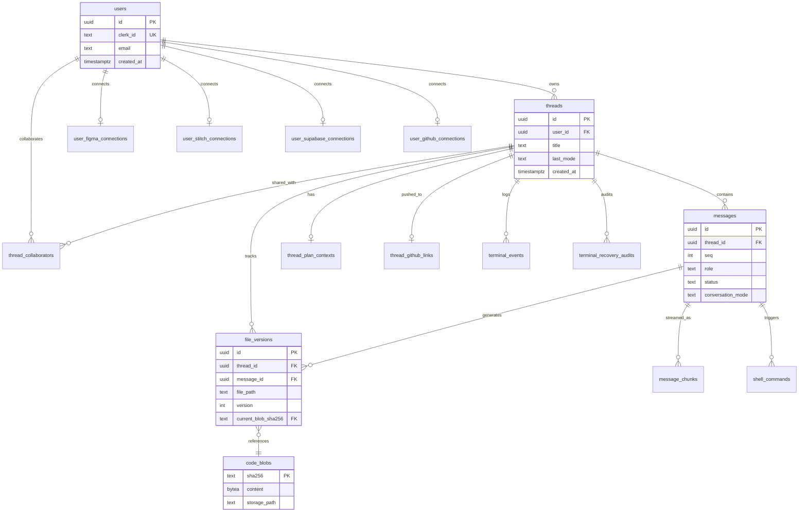

### Core Tables

| Table | Purpose |
|-------|---------|
| `users` | Internal user mapped from Clerk identity |
| `threads` | Conversation/project containers |
| `messages` | Ordered chat messages (`seq` per thread) |
| `message_chunks` | Streaming delta persistence |
| `file_versions` | Append-only file history per message |
| `thread_file_state` | Denormalized current snapshot for fast load |
| `code_blobs` | Content-addressed storage (SHA-256) |
| `thread_plan_contexts` | Approved plan text for build mode |
| `shell_commands` | Extracted shell operations |
| `terminal_events` | Terminal telemetry |
| `terminal_recovery_audits` | Auto-recovery attempts and outcomes |
| `thread_collaborators` | Shared access to threads |
| `sandbox_snapshots` | Dependency snapshot archives |
| `user_*_connections` | Per-user integration credentials |
| `thread_github_links` | Last pushed GitHub repo per thread |

### Concurrency

- **Advisory locks** per thread ensure correct message sequencing
- Finalization commits message completion + file/shell artifacts atomically
- Boot-time **orphan stream cleanup** marks stale `streaming` messages as `aborted`

---

## Storage & Caching

### Tiered Blob Storage

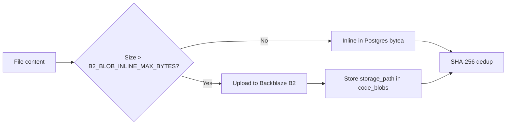

Configure B2 via `B2_KEY_ID`, `B2_APPLICATION_KEY`, `B2_BUCKET`, `B2_ENDPOINT`, `B2_REGION`.  
When unset, all blobs stay inline in Postgres (dev-friendly).

Migrate existing blobs: `npm run migrate:b2` (backend)

### Redis Cache (Optional)

[Upstash Redis](https://upstash.com) accelerates:

- Code blob L2 cache
- Sandbox dependency/template metadata
- Figma/Stitch MCP context (15-minute TTL)

Set `UPSTASH_REDIS_REST_URL` and `UPSTASH_REDIS_REST_TOKEN`.

### Local IndexedDB

Frontend caches dependency snapshots in IndexedDB for instant restore on repeat visits without hitting the network.

---

## API Reference

**Base URL (local):** `http://localhost:3003/api`

All authenticated routes require: `Authorization: Bearer <clerk_session_token>`

### Health (no `/api` prefix)

| Method | Path | Auth | Description |
|--------|------|------|-------------|
| GET | `/health` | ❌ | Liveness probe |
| GET | `/ready` | ❌ | Readiness probe (DB required) |

### Auth

| Method | Path | Description |
|--------|------|-------------|
| POST | `/auth/sync` | Mirror Clerk user to internal `users` table |

### Chat

| Method | Path | Body limit | Description |
|--------|------|------------|-------------|
| POST | `/chat` | 10 MB | Send prompt, stream assistant response |
| POST | `/chat/enhance-prompt` | 256 KB | AI-enhance user prompt before sending |
| POST | `/chat/transcribe` | 15 MB audio | Speech-to-text for voice input |
| GET | `/chat/history` | — | List user's threads |
| GET | `/chat/:threadId` | — | Fetch thread messages |
| DELETE | `/chat/:threadId` | — | Delete thread |
| GET | `/chat/:threadId/files` | — | Full current file snapshot |
| GET | `/chat/:threadId/files/delta?sinceSeq=N` | — | Incremental file changes |
| GET | `/chat/:threadId/versions` | — | List all file versions |
| POST | `/chat/:threadId/restore` | — | Restore files to a previous version |

**POST /chat body (key fields):**

```json
{
  "message": "Build a todo app",
  "threadId": "uuid-or-null",
  "model": "claude-sonnet-4.5",
  "mode": "build",
  "buildPhase": "full",
  "attachments": [],
  "figmaLinks": [],
  "stitchContext": null,
  "supabaseContext": null
}
```

### Preview (Public)

| Method | Path | Auth | Description |
|--------|------|------|-------------|
| GET | `/preview/:threadId` | ❌ | Fetch project files for hosted preview |

### Collaborators

| Method | Path | Description |
|--------|------|-------------|
| GET | `/chat/:id/collaborators` | List collaborators |
| POST | `/chat/:id/collaborators` | Invite by email `{ email, role? }` |
| DELETE | `/chat/:id/collaborators/:userId` | Remove collaborator |

### Terminal

| Method | Path | Body limit | Description |
|--------|------|------------|-------------|
| GET | `/terminal/:threadId/session` | — | Replay terminal session |
| POST | `/terminal/:threadId/events` | 10 MB | Append terminal events |
| POST | `/terminal/:threadId/recovery-audits` | — | Log recovery attempt |
| POST | `/terminal/:threadId/recover` | — | Server-side recovery |

### Sandbox Cache

| Method | Path | Description |
|--------|------|-------------|
| GET | `/sandbox/dependencies/:fingerprint` | Get dependency install plan |
| PUT | `/sandbox/dependencies/:fingerprint` | Store dependency plan |
| GET | `/sandbox/snapshots/:fingerprint` | Download snapshot archive |
| PUT | `/sandbox/snapshots/:fingerprint` | Upload snapshot archive |
| GET | `/sandbox/templates/:templateId` | Get template snapshot |
| PUT | `/sandbox/templates/:templateId` | Store template snapshot |

### Figma MCP

| Method | Path | Description |
|--------|------|-------------|
| GET | `/figma/status` | MCP enablement state |
| POST | `/figma/connect` | Store user Figma token |
| DELETE | `/figma/disconnect` | Remove connection |
| POST | `/figma/inspect` | Fetch design context from Figma URL |

### Google Stitch MCP

| Method | Path | Description |
|--------|------|-------------|
| GET | `/stitch/status` | MCP enabled + user connected |
| POST | `/stitch/connect` | `{ apiKey, defaultProjectId? }` |
| DELETE | `/stitch/disconnect` | Remove connection |
| POST | `/stitch/inspect` | Preview Stitch design context |

### GitHub Push

| Method | Path | Description |
|--------|------|-------------|
| GET | `/github/status` | Connected + GitHub login |
| POST | `/github/connect` | `{ accessToken }` (PAT with `repo` scope) |
| DELETE | `/github/disconnect` | Remove stored token |
| GET | `/github/link/:threadId` | Last pushed repo for thread |
| POST | `/github/push` | Push project files to GitHub |

### Supabase

| Method | Path | Auth | Description |
|--------|------|------|-------------|
| GET | `/supabase/oauth/callback` | ❌ | OAuth redirect handler |
| GET | `/supabase/oauth/start` | ✅ | Returns `{ authorizeUrl }` |
| GET | `/supabase/oauth/projects` | ✅ | List OAuth-authorized projects |
| POST | `/supabase/oauth/complete` | ✅ | Finalize with `{ projectRef }` |
| GET | `/supabase/status` | ✅ | Connection mode + MCP flags |
| POST | `/supabase/connect` | ✅ | Manual credential connect |
| DELETE | `/supabase/disconnect` | ✅ | Remove connection |
| GET | `/supabase/env` | ✅ | Browser-safe URL + anon key |
| GET | `/supabase/schema` | ✅ | Cached schema snapshot |
| POST | `/supabase/migrations/apply` | ✅ | Apply SQL migrations |
| POST | `/supabase/inspect` | ✅ | MCP schema/advisors/docs context |

---

## Environment Variables

### Frontend (`frontend/.env`)

```env
# Clerk — publishable key from Clerk dashboard
VITE_CLERK_PUBLISHABLE_KEY=pk_test_...

# Backend API — must match backend PORT (default: 3003)
VITE_API_URL=http://localhost:3003/api
```

### Backend (`backend/.env`)

```env
PORT=3003
FRONTEND_URL=http://localhost:5173

# ── Clerk ──────────────────────────────────────────
CLERK_SECRET_KEY=sk_test_...

# ── Database ───────────────────────────────────────
DATABASE_URL=postgresql://neondb_owner:<password>@<host>-pooler.<region>.aws.neon.tech/neondb?sslmode=require
# PG_POOL_MAX=25
# AUTH_USER_CACHE_TTL_MS=60000
# DB_CONNECT_TIMEOUT_MS=10000
# DB_STATEMENT_TIMEOUT_MS=120000

# ── AI Providers (at least one required) ───────────
OPENAI_API_KEY=sk-...
ANTHROPIC_API_KEY=sk-ant-...
GEMINI_API_KEY=...

# ── Email (optional — collaborator invites) ────────
# Gmail: enable 2FA, create App Password at https://myaccount.google.com/apppasswords
SMTP_HOST=smtp.gmail.com
SMTP_PORT=587
SMTP_USER=you@gmail.com
SMTP_PASS=your_app_password
# SMTP_FROM_EMAIL=you@gmail.com
# SMTP_FROM_NAME=NextGen

# ── Figma MCP (optional) ───────────────────────────
FIGMA_MCP_ENABLED=false
FIGMA_MCP_URL=https://mcp.figma.com/mcp
FIGMA_MCP_ACCESS_TOKEN=
FIGMA_MCP_HEADERS_JSON=
FIGMA_MCP_TIMEOUT_MS=45000

# ── Google Stitch MCP (optional) ───────────────────
STITCH_MCP_ENABLED=false
STITCH_MCP_URL=https://stitch.googleapis.com/mcp
STITCH_MCP_API_KEY=
STITCH_MCP_TIMEOUT_MS=45000

# ── Supabase OAuth (optional) ──────────────────────
SUPABASE_OAUTH_CLIENT_ID=
SUPABASE_OAUTH_CLIENT_SECRET=
SUPABASE_OAUTH_REDIRECT_URI=http://localhost:3003/api/supabase/oauth/callback

# ── Supabase MCP platform fallback (optional) ──────
SUPABASE_MCP_ENABLED=false
SUPABASE_MCP_URL=https://mcp.supabase.com/mcp
SUPABASE_MCP_ACCESS_TOKEN=
SUPABASE_MCP_PROJECT_REF=
SUPABASE_MCP_FEATURES=database,docs,debugging
SUPABASE_MCP_TIMEOUT_MS=45000

# ── Upstash Redis (optional) ───────────────────────
UPSTASH_REDIS_REST_URL=
UPSTASH_REDIS_REST_TOKEN=

# ── Backblaze B2 (optional — large blob offload) ───
B2_KEY_ID=
B2_APPLICATION_KEY=
B2_BUCKET=
B2_ENDPOINT=
B2_REGION=
B2_BLOB_INLINE_MAX_BYTES=65536
MAX_SNAPSHOT_BYTES=209715200

# ── Ops / tuning ───────────────────────────────────
SANDBOX_TOOLCHAIN_VERSION=webcontainer-npm-v1

# ── Logging ────────────────────────────────────────
# LOG_LEVEL=info          # debug | info | warn | error
# LOG_FORMAT=text         # text | json
# LOG_HTTP_HEALTH=false
```

### Variable Dependency Map

```mermaid
flowchart TD
    subgraph Required
        CLERK[CLERK keys]
        DB[DATABASE_URL]
        AI[At least 1 AI key]
    end
    subgraph Optional Features
        SMTP[SMTP_*] --> COLLAB[Collaborator email invites]
        B2[B2_*] --> BLOB[Large blob offload]
        REDIS[UPSTASH_*] --> CACHE[Blob + MCP cache]
        FIGMA[FIGMA_MCP_*] --> FIG[Figma import]
        STITCH[STITCH_MCP_*] --> STI[Stitch import]
        SUPA_OAUTH[SUPABASE_OAUTH_*] --> SUP[One-click Supabase]
        SUPA_MCP[SUPABASE_MCP_*] --> SUP
    end
    Required --> APP[NextGen runs]
    Optional Features --> APP
```

---

## Integrations

### Figma Import

Paste a Figma file/frame/layer URL into the chat toolbar. The backend resolves design context via Figma MCP and injects it into the build prompt.

**Setup options:**
1. **Per-user token** — connect via UI (`POST /figma/connect`)
2. **Server token** — set `FIGMA_MCP_ACCESS_TOKEN` in backend env

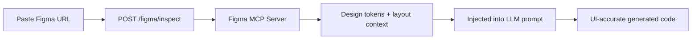

### Google Stitch Import

Import design context from [Google Stitch](https://stitch.withgoogle.com):

1. Obtain a Stitch API key
2. Connect via Stitch panel in chat toolbar
3. Attach project/screen context before sending a message
4. Backend calls `https://stitch.googleapis.com/mcp`

### Supabase Backend

Full-stack apps with real databases:

**One-click OAuth (recommended):**

1. Register OAuth app in [Supabase dashboard](https://supabase.com/dashboard/org/_/integrations)
2. Redirect URI: `http://localhost:3003/api/supabase/oauth/callback`
3. Scopes: **Projects Read** + **Secrets Read**
4. Set `SUPABASE_OAUTH_CLIENT_ID`, `SUPABASE_OAUTH_CLIENT_SECRET`, `SUPABASE_OAUTH_REDIRECT_URI`
5. In chat toolbar: **Supabase → Connect with Supabase → pick project**

**What gets configured automatically:**
- Project URL + anon key injected into WebContainer env
- MCP access for schema/advisors/docs
- SQL migrations via `supabase-migration` bolt actions

**Manual fallback:** paste URL, anon key, MCP PAT, service role, and database URL in the panel.

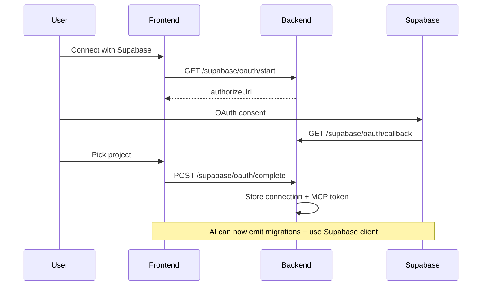

### GitHub Push

Export generated projects to GitHub:

1. Create a PAT with `repo` scope
2. Connect in workbench **GitHub** modal
3. Choose create new repo or push to existing
4. Files exclude `node_modules`, `.git`, `.boltly`

Last pushed repo per thread is remembered in `thread_github_links`.

### Email Invites

When SMTP is configured, collaborator invites send a branded HTML email with:
- Inviter name
- Project title
- Direct link to thread (`/?threadId=...`)
- NextGen logo embedded from `backend/assets/nextgen-logo.png`

---

## Build, Test & Production

### Frontend

```bash
cd frontend
npm run build      # tsc -b && vite build
npm run preview    # Preview production build locally
npm run lint       # ESLint
```

Output: `frontend/dist/`

### Backend

```bash
cd backend
npm run build      # tsc → dist/
npm run start      # node dist/server.js
npm test           # Build + node --test tests/*.test.js
npm run migrate:b2 # Migrate inline blobs to Backblaze B2
```

### Test Suite

| Test file | Coverage |
|-----------|----------|
| `chat-mode-policy.test.js` | Plan vs build mode enforcement |
| `plan-context.test.js` | Plan context storage and retrieval |
| `prompt-enhancement.test.js` | Prompt enhancement service |
| `figma-context-policy.test.js` | Figma context injection rules |
| `thread-title.test.js` | Auto thread title generation |

### Production Checklist

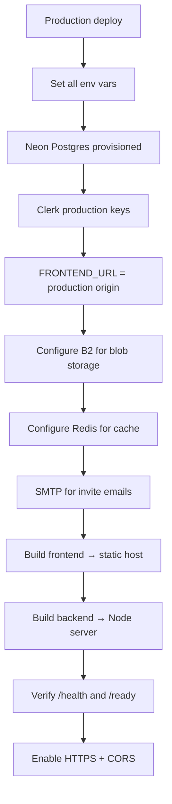

> **No Docker/CI configs ship with the repo yet.** See [Roadmap](#roadmap).

---

## Security & Reliability

| Concern | Mitigation |
|---------|------------|
| Authentication | Clerk JWT verification on all `/api/*` routes (except public preview/OAuth callback) |
| User isolation | Internal UUID separate from Clerk ID; thread access scoped to owner + collaborators |
| Race conditions | Per-thread Postgres advisory locks for message/file sequencing |
| Stream interruption | Chunks persisted incrementally; orphan streams aborted on boot |
| Credential storage | Integration tokens stored server-side only; never sent to frontend (except browser-safe Supabase anon key) |
| CORS | Restricted to `FRONTEND_URL` + localhost origins |
| Request tracing | `X-Request-Id` on every request for log correlation |
| Blob dedup | SHA-256 content addressing prevents duplicate storage |
| Snapshot failures | Retry metadata tracked; no silent data loss |

---

## Troubleshooting

### Auth errors on chat

- Verify `VITE_CLERK_PUBLISHABLE_KEY` (frontend) and `CLERK_SECRET_KEY` (backend)
- Confirm user is signed in; check browser Network tab for `Authorization: Bearer` header
- Ensure `POST /api/auth/sync` succeeds after login

### Backend won't start (DB errors)

- Validate `DATABASE_URL` — use Neon **pooler** URL with `?sslmode=require`
- Check `/ready` endpoint: `curl http://localhost:3003/ready`
- Review logs: set `LOG_LEVEL=debug`

### Port mismatch (frontend can't reach backend)

- Backend default: **3003** (see `backend/.env.example`)
- Frontend must set: `VITE_API_URL=http://localhost:3003/api`
- If port in use: change `PORT` in backend `.env` and update frontend accordingly

### CORS errors

- Set `FRONTEND_URL=http://localhost:5173` (or your actual origin)
- Localhost origins on any port are allowed automatically

### Slow repeated `npm install`

- Expected on first run or changed `package.json` fingerprint
- Subsequent loads should hit IndexedDB or remote snapshot cache
- Configure Redis + B2 for faster cross-device snapshot reuse

### Thread restore incomplete

- Check if stream was interrupted (message status `aborted` or `streaming`)
- Use full snapshot: `GET /api/chat/:threadId/files` instead of delta
- Verify file finalization completed (not mid-stream)

### Collaborator invite not received

- Confirm SMTP env vars are set (`SMTP_HOST`, `SMTP_USER`, `SMTP_PASS`)
- Target user must already be registered on NextGen
- Check backend logs for `email.invite_sent` or SMTP errors

### WebContainer preview blank

- Check terminal panel for build errors
- Auto-recovery should trigger for recoverable issues (up to 3 rounds)
- Try manual fix in terminal or re-prompt the AI

### Clerk UI looks wrong

- Custom theme lives in `frontend/src/config/clerkAppearance.ts`
- CSS overrides in `frontend/src/index.css` under "Clerk auth UI"

---

## Roadmap

- [ ] OpenAPI / Swagger spec for the full API
- [ ] Docker Compose for one-command local dev
- [ ] CI/CD pipeline (GitHub Actions)
- [ ] Integration tests for streaming + sandbox snapshot lifecycle
- [ ] Per-provider latency/error dashboards
- [ ] Deploy guides (Vercel frontend + Railway/Fly backend)
- [ ] Real-time collaborative editing (multiplayer cursors)
- [ ] Custom domain hosted previews
- [ ] Plugin / MCP marketplace

---

<p align="center">
  <strong>Meet the team.</strong>
</p>

<p align="center">
  
</p>

<p align="center">
  <em>
    Weekly sync at The Drunken Clam. Four mics, four beers, zero unit tests.<br />
    Peter hosts the podcast. Quagmire "reviews PRs." Cleveland monitors uptime. Joe runs retros — seated, always.
  </em>
</p>

<p align="center">
  <sub>
    None of them have read the README. Two of them aren't sure what an API is.<br />
    All of them pushed directly to main at least once. The third one was a force push.<br />
    If this app works, that's a bug we haven't gotten around to fixing yet.
  </sub>
</p>
