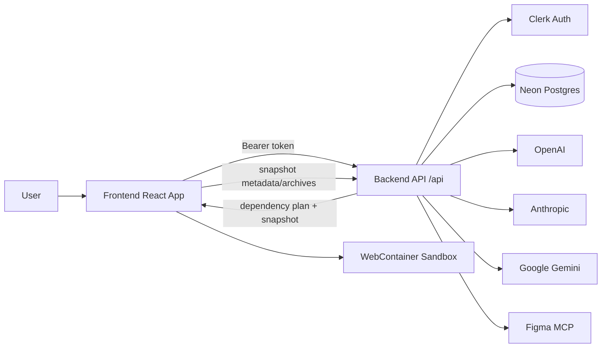
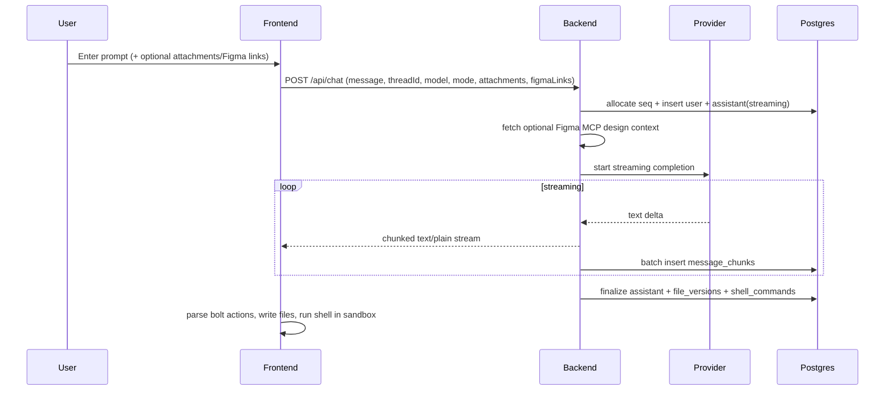
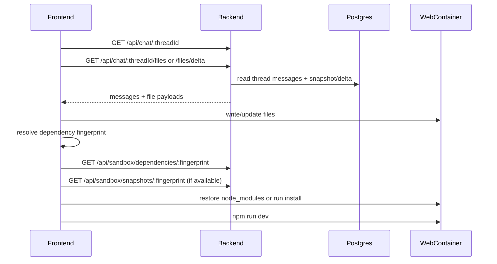
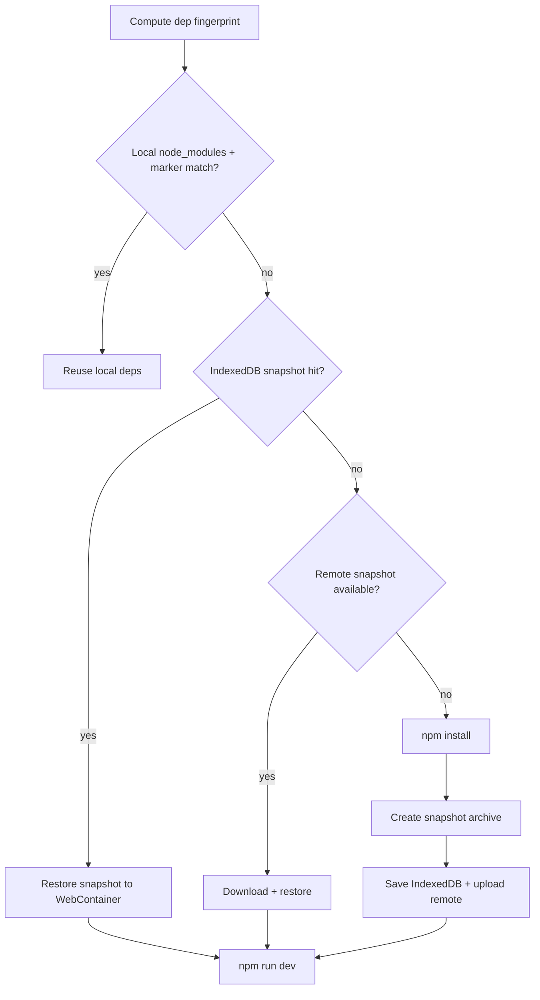

# Boltly NextGen (Unified Project)

End-to-end AI builder platform with:
- a `frontend/` React + Vite client
- a `backend/` Express + TypeScript API
- Neon Postgres persistence (code blobs and sandbox snapshots stored inline)
- Clerk auth
- multi-provider LLM streaming (OpenAI, Anthropic, Gemini)
- optional Figma MCP design-context import
- optional Google Stitch MCP design-context import (API key)
- push project files to GitHub (PAT, create or existing repo)
- WebContainer sandbox boot/install/snapshot reuse

This README is the single source of truth for architecture, data flow, setup, and operations.

---

## Table of Contents

- Overview
- Repository Layout
- System Architecture
- End-to-End Flows
- API Surface
- Data Model (Conceptual)
- Environment Variables
- Local Development
- Build, Test, and Production Notes
- Troubleshooting
- Security and Reliability Notes
- Roadmap Ideas

---

## Overview

Boltly NextGen lets users chat with an AI to plan/build apps. The backend streams model output while the frontend:
- renders assistant markdown in real time
- extracts structured `boltAction` artifacts from the stream
- writes generated files into a browser WebContainer
- runs shell commands (`npm install`, `npm run dev`) in sandbox
- keeps thread-specific terminal/session state and recovery trails

The platform supports two conversation modes:
- `plan`: architectural reasoning and implementation planning (no file/shell actions expected)
- `build`: actionable generation with file and shell operations

---

## Repository Layout

> There is **no root `package.json`**. Run commands from `frontend/` or `backend/`.

```text
boltly-nextgen/
  frontend/                 # React + Vite UI, WebContainer runtime, chat UX
  backend/                  # Express API, LLM orchestration, persistence
  README.md                 # Unified documentation (this file)
```

High-value frontend modules:
- `frontend/src/hooks/useChat.ts` – chat orchestration, stream parsing, sandbox lifecycle, dependency snapshot logic
- `frontend/src/components/Chat/*` – chat panel, input, messages, mode/model controls
- `frontend/src/components/Workbench/*` – editor, preview, terminal UI
- `frontend/src/store/*` – Jotai atoms for chat, files, sandbox runtime

High-value backend modules:
- `backend/src/controllers/chatController.ts` – streaming chat endpoints
- `backend/src/services/chatService.ts` – provider selection, mode policy, persistence pipeline
- `backend/src/services/figmaMcpClient.ts` – Streamable HTTP MCP client for Figma tools
- `backend/src/services/figmaDesignContextService.ts` – Figma URL parsing + prompt context assembly
- `backend/src/controllers/sandboxController.ts` – dependency plan/snapshot APIs
- `backend/src/controllers/terminalController.ts` – terminal events + recovery audits
- `backend/src/repositories/*` – thread/message/file/blob/session persistence
- `backend/src/lib/redis.ts` – shared Upstash Redis client (blob L2 cache, sandbox + MCP context)
- `backend/src/config/db.ts` – Postgres pool init and transaction helpers

---

## System Architecture



### Responsibilities Split

- **Frontend**
  - Auth bootstrap + route transitions (`/` and `/builder`)
  - Streaming UI rendering
  - Bolt artifact parsing + file tree updates
  - WebContainer install/dev-server lifecycle
  - Local snapshot cache (IndexedDB) and remote snapshot reuse handshake
  - Terminal telemetry + auto-recovery trigger

- **Backend**
  - Token-guarded API surface (Clerk middleware)
  - Thread + message sequencing with advisory locks
  - Streaming model responses
  - File version + shell command persistence
  - Plan/build mode policy enforcement
  - Sandbox dependency metadata + snapshot object storage
  - Terminal event/recovery audit persistence

---

## End-to-End Flows

## 1) User Sends a Prompt



Key behavior:
- Backend persists content safely even on interruptions (`streaming` -> `aborted`/`error` when needed).
- Frontend performs optimistic UI update and progressively hydrates assistant output.
- In `build` mode, generated files/shell commands are executed in sandbox context.

## 2) Thread Reload / Restore



## 3) Sandbox Dependency Snapshot Loop



## 4) Terminal Recovery Audit Flow

- Frontend reports terminal events to:
  - `POST /api/terminal/:threadId/events`
- On detected runtime issue, frontend runs planned recovery commands and logs:
  - `POST /api/terminal/:threadId/recovery-audits`
- Session replay endpoint:
  - `GET /api/terminal/:threadId/session`

---

## API Surface

Base URL (local): `http://localhost:3001/api`

### Auth
- `POST /auth/sync` – ensure Clerk user is mirrored to internal user row

### Chat
- `POST /chat` – send user prompt, stream assistant response
- `GET /chat/history` – list user threads
- `GET /chat/:threadId` – fetch thread messages
- `GET /chat/:threadId/files` – full current thread snapshot
- `GET /chat/:threadId/files/delta?sinceSeq=<n>` – incremental file changes

### Figma MCP
- `GET /figma/status` – report backend Figma MCP enablement/config state
- `POST /figma/inspect` – fetch read-only design context for a Figma file/frame/layer URL

### Google Stitch MCP
- `GET /stitch/status` – MCP enabled + user connected
- `POST /stitch/connect` – `{ apiKey, defaultProjectId? }`
- `DELETE /stitch/disconnect` – remove user connection
- `POST /stitch/inspect` – preview Stitch design context

### GitHub Push
- `GET /github/status` – connected + GitHub login
- `POST /github/connect` – `{ accessToken }` (PAT with repo scope)
- `DELETE /github/disconnect` – remove stored token
- `GET /github/link/:threadId` – last pushed repo for thread
- `POST /github/push` – push WebContainer project files to GitHub

### Terminal
- `GET /terminal/:threadId/session`
- `POST /terminal/:threadId/events`
- `POST /terminal/:threadId/recovery-audits`

### Sandbox Cache/Snapshot
- `GET /sandbox/dependencies/:fingerprint`
- `PUT /sandbox/dependencies/:fingerprint`
- `GET /sandbox/snapshots/:fingerprint`
- `PUT /sandbox/snapshots/:fingerprint`
- `GET /sandbox/templates/:templateId`
- `PUT /sandbox/templates/:templateId`

---

## Data Model (Conceptual)

Core entities used by repositories:
- `users` – internal user mapped from Clerk identity
- `threads` – conversation containers (`last_mode`, plan metadata)
- `messages` – ordered by per-thread `seq`, with statuses
- `message_chunks` – streaming delta persistence
- `file_versions` – append-only file history per message
- `thread_file_state` – denormalized current file snapshot for fast load
- `code_blobs` – content-addressed storage metadata (`sha256`)
- `plan_contexts` – approved plan text reused for build mode context
- `shell_commands` – extracted shell operations linked to message/thread
- `terminal_events` – persisted terminal telemetry
- `terminal_recovery_audits` – recovery attempts and outcomes

Concurrency and integrity:
- Per-thread advisory locks ensure sequence/version correctness.
- Finalization path commits message completion + file/shell artifacts together.
- Boot-time orphan-stream cleanup marks stale `streaming` messages as `aborted`.

---

## Environment Variables

## Frontend (`frontend/.env`)

```env
VITE_CLERK_PUBLISHABLE_KEY=pk_test_...
VITE_API_URL=http://localhost:3001/api
```

## Backend (`backend/.env`)

```env
PORT=3001
FRONTEND_URL=http://localhost:5173

# Clerk
CLERK_PUBLISHABLE_KEY=pk_test_...
CLERK_SECRET_KEY=sk_test_...

# Neon Postgres
DATABASE_URL=postgresql://neondb_owner:<password>@<host>-pooler.<region>.aws.neon.tech/neondb?sslmode=require

# Optional cache/ops (Upstash Redis)
# Used for: code blob L2 cache, sandbox dependency/template metadata, Figma/Stitch MCP context (15m TTL)
UPSTASH_REDIS_REST_URL=
UPSTASH_REDIS_REST_TOKEN=
SANDBOX_TOOLCHAIN_VERSION=webcontainer-npm-v1
DB_CONNECT_TIMEOUT_MS=10000

# AI providers
OPENAI_API_KEY=sk-...
ANTHROPIC_API_KEY=sk-ant-...
GEMINI_API_KEY=...

# Optional Figma MCP design context
FIGMA_MCP_ENABLED=false
FIGMA_MCP_URL=https://mcp.figma.com/mcp
FIGMA_MCP_ACCESS_TOKEN=
FIGMA_MCP_HEADERS_JSON=
FIGMA_MCP_TIMEOUT_MS=45000

# Optional Google Stitch MCP design context (per-user API key via UI; env key is fallback)
STITCH_MCP_ENABLED=false
STITCH_MCP_URL=https://stitch.googleapis.com/mcp
STITCH_MCP_API_KEY=
STITCH_MCP_TIMEOUT_MS=45000

# Optional logging
LOG_LEVEL=info
LOG_FORMAT=text
LOG_HTTP_HEALTH=false
```

---

## Local Development

Use two terminals.

## 1) Backend

```bash
cd backend
npm install
npm run dev
```

Backend health check:
- `GET http://localhost:3001/health`

## 2) Frontend

```bash
cd frontend
npm install
npm run dev
```

Frontend default URL:
- `http://localhost:5173`

---

## Integrations

### Google Stitch MCP

1. Obtain a Stitch API key from Google Stitch.
2. In the chat input toolbar, click the Stitch button and connect your API key (optionally set a default project ID).
3. Attach context (project ID, prompt, and/or screen ID) before sending a message.
4. The backend resolves design context via `https://stitch.googleapis.com/mcp` and injects it into the system prompt.

Optional server fallback env vars: `STITCH_MCP_ENABLED`, `STITCH_MCP_API_KEY`, `STITCH_MCP_URL`.

### GitHub Push

1. Create a GitHub Personal Access Token with `repo` scope.
2. In the workbench file tree, click **GitHub** and connect your token (stored server-side only).
3. Choose **Create new repo** or **Push to existing**, set branch and commit message, then push.
4. Files are collected from the WebContainer (same paths as zip download; excludes `node_modules`, `.boltly`, `.git`).

The last pushed repo per thread is remembered via `thread_github_links`.

---

## Build, Test, and Production Notes

## Frontend

```bash
cd frontend
npm run build
npm run preview
```

## Backend

```bash
cd backend
npm run build
npm run start
```

## Backend tests

```bash
cd backend
npm test
```

Current test target includes chat mode policy validation.

---

## Troubleshooting

## App boots but chat fails with auth errors
- Verify Clerk keys in both frontend and backend env files.
- Confirm browser session is signed in.
- Ensure `Authorization: Bearer <token>` is reaching backend.

## Backend won’t start (DB errors)
- Validate `SUPABASE_DB_URL`, `SUPABASE_URL`, and `SUPABASE_SERVICE_ROLE_KEY`.
- Confirm DB/network reachability from your machine.
- If pooler auth has tenant/user mismatch, backend includes a direct-host fallback path.

## Frontend can’t call backend (CORS)
- Confirm `FRONTEND_URL` matches actual frontend origin.
- Default allowed origin is `http://localhost:5173`.

## Slow or repeated `npm install` inside sandbox
- Expected on first run or changed dependency fingerprint.
- Subsequent runs should improve via local and remote snapshot reuse.

## Thread restore seems stale/incomplete
- Check `/chat/:threadId/files/delta` behavior and fallback to full snapshot path.
- Verify thread/file writes were finalized (not interrupted stream only).

---

## Security and Reliability Notes

- Auth-required API routes are guarded by Clerk middleware.
- Internal user IDs are separate from external Clerk IDs.
- Message/file sequencing uses DB advisory locks to prevent race conditions.
- Streaming chunks are persisted incrementally to reduce data loss risk on interruption.
- Backend logs support request-level correlation (`X-Request-Id` exposure).
- Snapshot upload failures are tracked with retry metadata instead of silent failure.

---

## Roadmap Ideas

- Baseline schema lives in `backend/migrations/001_baseline_schema.sql` (exported from production).
- Add OpenAPI/Swagger spec for the full API.
- Expand integration tests for streaming + sandbox snapshot lifecycle.
- Add per-provider latency/error dashboards.
- Add deploy guides (Docker, managed secrets, CI/CD pipeline).
